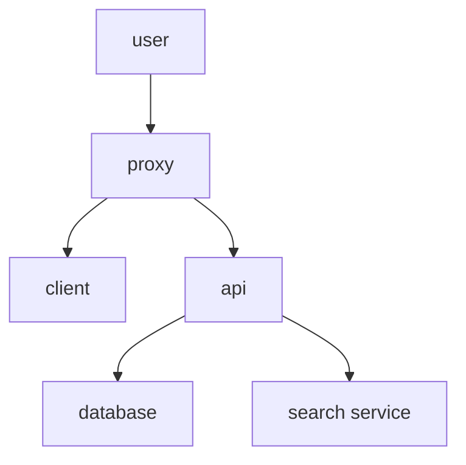

# [Networth](https://networth.shodon.ru)

## Demo

Here is a working live demo : https://networth.shodon.ru/

## Table of Contents:

1. [Introduction](#introduction)
2. [Concepts](#concepts)
3. [Installation and Running](#installation-and-running)
   1. [Preload](#preload)
   2. [Install Networth](#2-install-networth)
   3. [Add env files](#3-add-env-files)
   4. [Run project](#4-run-project)
   5. [Show logs](#5-show-logs)
   6. [Enter the terminal](#6-enter-the-container-terminal)
4. [Documentation](#documentation)

## Introduction

Welcome to Networth, a cutting-edge social network designed to transform the way you connect, share, and engage with others. Networth is not just another social platform; it’s a dynamic and powerful tool that offers:

- **Speed**: Experience lightning-fast load times and seamless interactions, ensuring that you stay connected without any delays.
- **Simplicity**: Our user-friendly interface is designed to be intuitive and easy to navigate, making it accessible for users of all ages and tech-savviness levels.
- **Advanced Features**: Enjoy a range of advanced features that go beyond basic social networking, including robust privacy settings, custom feeds, and powerful search capabilities.
- **Security**: Your data and privacy are our top priorities. Networth employs state-of-the-art security measures to keep your information safe and secure. ([more about security](./docs/security.md))
- **Engagement**: Whether you’re sharing updates, photos, or videos, Networth provides a rich and immersive experience that keeps you and your friends engaged.
- **Customization**: Tailor your experience with personalized settings and themes, allowing you to make Networth truly your own.
- **Community**: Join a vibrant and growing community where you can find and connect with like-minded individuals and groups.

Networth is built to empower you with the tools and features you need to build meaningful connections and share your story with the world. Join us today and be part of the future of social networking.

## Concepts



In this section, we explain the key concepts and terminologies used in Networth, including assets, liabilities, and net worth calculations.

## Installation and Running

### 1. Preload

Please download this apps to use networth

1. Install and run Docker Engine [how to install docker guide](https://docs.docker.com/engine/install/)
2. Install Make (GNU вроде) () [how to install make guide for gays](https://gnuwin32.sourceforge.net/packages/make.htm)
3. Install git [download git](https://git-scm.com/downloads)
4. Install a normal terminal (bash for example)

You can don't install make and copy the commands from "Makefile" files. (But it's better to set "make")

### 2. Install Networth

I don't know what to write here, fuck off bro

#### 1. Install networth repository: <br />

```bash
git clone https://github.com/shodon2007/networth
```

#### 2. Install subrepositories

```bash
# yes, just write "make" :)
make
```

### 3. Add .env files

Environment files is are very important so don't forget some fields, bro

#### 1. Add prod.env and dev.env to networth-client

Create **dev.env** and add this fields:

```env
API_URL=http://localhost:3003
TEST_USER_EMAIL=work@shodon.ru
TEST_USER_PASSWORD=shodon2007
```

And create **prod.env** and add this fields:

```env
API_URL=http://localhost:3000
TEST_USER_EMAIL=work@shodon.ru
TEST_USER_PASSWORD=shodon2007
```

#### 2. Add .env to networth-api

write this fields:

```env
PORT=3000
WSPORT=3001
HOST=localhost
DB_HOST=db
# DB_HOST=localhost
USER=root
DB=networth
DB_PORT=3306
PASSWORD=shodon2007
SERVER_PORT=4000
JWT_ACCESS_SECRET=shodon2007
JWT_REFRESH_SECRET=shodon2007

SMTP_HOST=smtp.mail.ru
SMTP_PORT=465
SMTP_USER=help.networth@mail.ru
SMTP_PASSWORD=4QVfLxEfLYRgZ9JcSJSF

API_URL=https://networth.shodon.ru
CLIENT_URL=https://store.shodon.ru
SEARCH_URL=http://search:7700
# SEARCH_URL=http://localhost:7700

SEARCH_MASTER_KEY=shodon2007
```

some fields (SMTP_PASSWORD) need to get it from the admin (me@shodon.ru)

#### 3. Add .env file to networth-db

```env
MARIADB_ROOT_PASSWORD=shodon2007
```

#### 4. Add .env file to networth-proxy

```env
CLIENT_PORT=80
API_PORT=3000

SERVER_NAME=localhost

NETWORK_API_URL=http://api:3000
NETWORK_CLIENT_URL=http://client
```

#### 5. Add .env file to networth-search

```env
MEILI_MASTER_KEY=shodon2007
MEILI_API_KEY=shodon2007
```

### 4. Run project

#### 1. How to run networth from docker-compose

```bash
make start
```

#### 2. How to run networth-client separately

1. Run docker-compose (step 1)
2. Run `npm install` in networth-client
3. Run `npm start` in networth-client

#### 3. How to run networth-api separately

1. Run docker-compose (step 1)
2. Run `npm install` in networth-api
3. Run `npm start:dev` in networth-api

#### 4. How to run networth-api and networth-client without docker-compose

1. **Run docker-compose** (step 1)
2. Run networth-client (step 2)
3. Run networth-api (step 3)

but after running docker-compose you need to **run networth-client, networth-api in another ports** to **avoid conflict** with docker-compose

### 5. Show logs

you may see the logs with the commands:

- `make logs` - see all logs (api, client, db, search, proxy)
- `make logs:api` - see api logs
- `make logs:client` - see client logs
- `make logs:db` - see db logs
- `make logs:proxy` - see proxy logs
- `make logs:search` - see search logs

### 6. Enter the container terminal

you can enter the terminal with the commands:

- `make enter:api` - enter api terminal
- `make enter:client` - enter client terminal
- `make enter:db` - enter db terminal
- `make enter:proxy` - enter proxy terminal
- `make enter:search` - enter search terminal

## Documentation

For more detailed information, please refer to our [documentation](https://networth.shodon.com).
