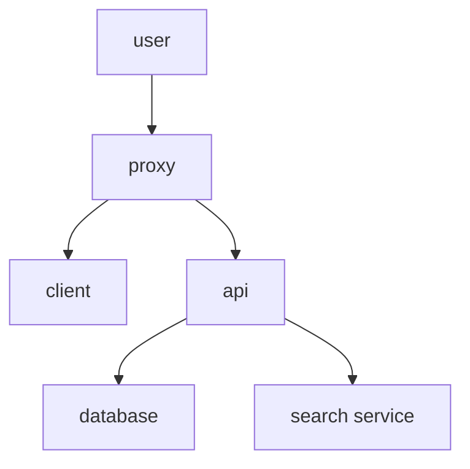

# [Networth](https://networth.shodon.ru)

## Table of Contents:

1. [Introduction](#introduction)
2. [Concepts](#concepts)
3. [Installation and Running](#installation-and-running)
   1. [Preload](#preload)
4. [Documentation](#documentation)

## Introduction

Welcome to Networth, a cutting-edge social network designed to transform the way you connect, share, and engage with others. Networth is not just another social platform; it’s a dynamic and powerful tool that offers:

- **Speed**: Experience lightning-fast load times and seamless interactions, ensuring that you stay connected without any delays.
- **Simplicity**: Our user-friendly interface is designed to be intuitive and easy to navigate, making it accessible for users of all ages and tech-savviness levels.
- **Advanced Features**: Enjoy a range of advanced features that go beyond basic social networking, including robust privacy settings, custom feeds, and powerful search capabilities.
- **Security**: Your data and privacy are our top priorities. Networth employs state-of-the-art security measures to keep your information safe and secure. ([more about security](./docs/security.md))
- **Engagement**: Whether you’re sharing updates, photos, or videos, Networth provides a rich and immersive experience that keeps you and your friends engaged.
- **Customization**: Tailor your experience with personalized settings and themes, allowing you to make Networth truly your own.
- **Community**: Join a vibrant and growing community where you can find and connect with like-minded individuals and groups.

Networth is built to empower you with the tools and features you need to build meaningful connections and share your story with the world. Join us today and be part of the future of social networking.

## Concepts

In this section, we explain the key concepts and terminologies used in Networth, including assets, liabilities, and net worth calculations.

## Installation and Running

### Preload

Here we provide detailed instructions on how to install and run Networth. This includes information on system requirements, dependencies, and step-by-step installation procedures.

## Documentation

For more detailed information, please refer to our [documentation](https://networth.shodon.com).
